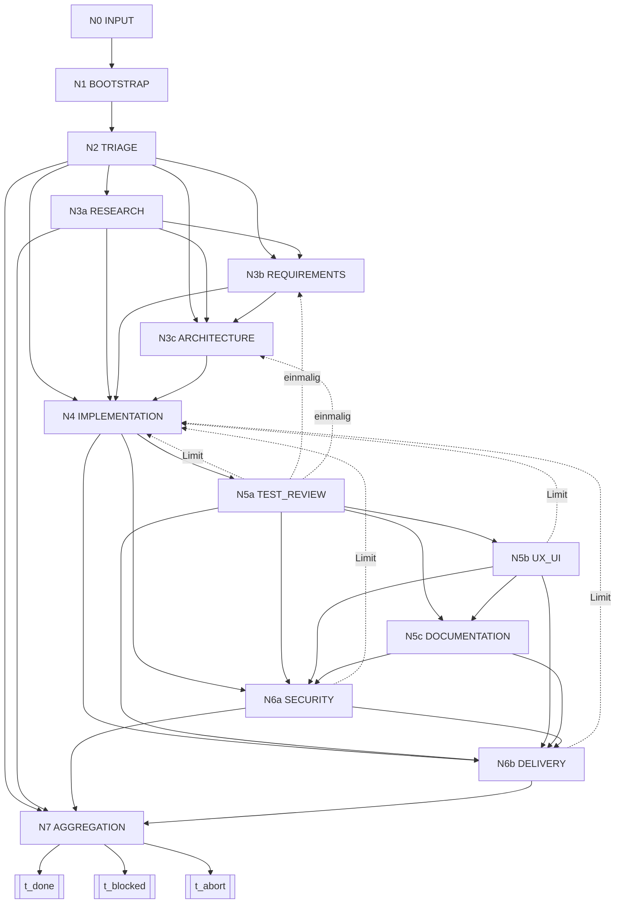

# Ablauf — Knoten, Kanten, Terminalzustände

> Normativ für `LAW-CFG` und `LAW-TERMINAL`. Es gibt **eine** Knoten-Nummerierung:
> `N0 … N7` mit Sub-Buchstaben. Ältere Zählungen sind ersetzt; die Alt→Neu-Tabelle steht in
> `docs/migration-v1-to-v2.md`, nicht hier.
> Maschinenlesbare Quelle der Topologie: `manifest.json` (Abschnitt `cfg`), abgeleitet aus
> `runtime/architecture/cfg-v2-nodes.json`. Alle Zahlen: `config/policy-defaults.json`.
> Welche Knoten eine Anfrage durchläuft, entscheidet `modules/triage.md`.

## 1. Ablauf in fünf Sätzen

1. Jeder Lauf beginnt bei `N0` und endet in **genau einem** Terminalzustand — nie stillschweigend.
2. `N1`, `N2` und `N7` sind Pflichtknoten; alle übrigen Knoten sind **Gates** und werden nur
   betreten, wenn sie in `Gates(Anfrage)` stehen (`modules/triage.md`).
3. Vorwärtsfortschritt ist die Regel: eine Kante darf nur zu einem Knoten mit höherem Rang führen.
4. Rückkanäle existieren, aber **nur mit Zähler und Limit**; Zähler setzen nie zurück.
5. Ein Knoten gilt erst als abgeschlossen, wenn sein DoD mit **ausgeführtem** Nachweis belegt ist
   (`LAW-DOD`, `modules/tools.md#verifizierung`); ein nicht ausgeführter Nachweis ist kein Nachweis.

## 2. Knoten {#knoten}

Art: `Pflicht` = immer, `Gate` = nur wenn in `Gates(Anfrage)`. Rang ordnet den Vorwärtsfortschritt;
Sub-Buchstaben ordnen innerhalb eines Rangs (`a` < `b` < `c`). Neue Knoten werden als Sub-Buchstabe
eingehängt, damit bestehende Zitate nicht brechen.

| ID | Rang | Name | Rolle | Art | Eintritt |
|----|------|------|-------|-----|----------|
| `N0` | 0 | INPUT / Eingang | — | Pflicht | Nutzer-Prompt liegt vor |
| `N1` | 1 | BOOTSTRAP / Start | orchestrator | Pflicht | immer |
| `N2` | 2 | TRIAGE / Einordnung + Klärungsprüfung | orchestrator | Pflicht | immer; bei blockierender Unsicherheit → `awaiting_user` (`modules/clarification.md`) |
| `N3a` | 3 | RESEARCH / Recherche | researcher | Gate | Wissenslücke, externe Quelle nötig |
| `N3b` | 4 | REQUIREMENTS / Anforderungen | business_analyst | Gate | Gate-Set der Klasse |
| `N3c` | 5 | ARCHITECTURE / Architektur | architect | Gate | Flag `arch`/`conc` oder Eskalation aus `N5a` |
| `N4` | 6 | IMPLEMENTATION / Bau | developer | Gate | Änderung am Repository verlangt |
| `N5a` | 7 | TEST_REVIEW / Test & Review | tester_reviewer | Gate | Gate-Set der Klasse |
| `N5b` | 7 | UX_UI / Oberfläche | ux_ui_expert | Gate | Flag `ui` |
| `N5c` | 7 | DOCUMENTATION / Doku | documentation_specialist | Gate | Flag `api` |
| `N6a` | 8 | SECURITY / Sicherheit | security_auditor | Gate | Flag `sec`, `data` oder `legal` |
| `N6b` | 8 | DELIVERY / Lieferung | developer / devops_sre | Gate | Ergebnis soll ausgeliefert werden |
| `N7` | 9 | AGGREGATION / Abschluss | orchestrator | Pflicht | immer (letzter Knoten vor Terminal) |

## 3. DoD je Knoten

Jede Zeile ist eine Bedingung, die **vor** dem Verlassen des Knotens erfüllt sein muss. „Nachweis"
nennt die Art des Belegs; der ausgeführte Befehl und sein Exit-Code gehören nach `dod_gates`.

| ID | DoD (hart, nachweisbar) | Nachweis |
|----|-------------------------|----------|
| `N0` | `original_user_prompt` gesetzt; Prompt als umsetzbar, unklar oder verboten eingeordnet | State schema-valide |
| `N1` | Kern gelesen; State-Lock gehalten; GC-Sweep gelaufen (Vorschau-Default); Memory-Ingestion abgeschlossen (Provenienz, TTL, Poisoning-Prüfung); `budget`-Zähler initialisiert | `scripts/state-lock.sh`, `scripts/gc-sweep.sh`, Exit 0 |
| `N2` | `triage.change_class` gesetzt (genau eine Klasse); `triage.signals` gesetzt; `triage.rationale` nennt die getroffene Regelzeile; `Gates(Anfrage)` in `dod_gates` materialisiert | `scripts/check-triage.sh`, Exit 0 |
| `N3a` | jede Erkenntnis mit Quelle oder ausdrücklichem Unsicherheitsvermerk; bei Flag `sec` Schwachstellen-Recherche durchgeführt | Bericht unter `runtime/reports/` |
| `N3b` | testbare Akzeptanzkriterien (Given/When/Then), je Kriterium **ein** Prüfkommando; keine offene Mehrdeutigkeit ohne dokumentierte Annahme | Bericht + Traceability-Tabelle |
| `N3c` | mindestens ein Architekturentscheid mit Kontext, Optionen, Entscheidung, Konsequenzen; keine neue Abhängigkeitsrichtung ohne Entscheid; bei Flag `conc` zusätzlich Nebenläufigkeitsmodell | Bericht; bei `conc` Modellprüfung Exit 0 |
| `N4` | Build und Lint grün; keine Geheimnisse im Diff; Schnittstellen eingehalten; Arbeitsbranch in `vcs.branches` registriert | projektspezifisch, Exit 0 |
| `N5a` | jedes Akzeptanzkriterium hat mindestens einen Test; Suite Exit 0; Konformitätsprüfung gegen die bestehende Architektur bestanden (kein neuer Abhängigkeitszyklus, keine unbegründete Drift) außer bei Klasse `chore` und `revert`; bei Flag `perf` Budget geprüft | Suite Exit 0, Protokoll unter `proof-artifacts/` |
| `N5b` | visuelle Regression Exit 0; Barrierefreiheits-Mindestprüfung dokumentiert; Konsistenz mit dem bestehenden Entwurfssystem | Snapshot-Lauf Exit 0 |
| `N5c` | jede öffentlich sichtbare Änderung dokumentiert; Changelog-Eintrag vorhanden; keine Dokumentation widerspricht dem Verhalten | Diff enthält Doku-Änderung |
| `N6a` | kein offenes kritisches oder hohes Ergebnis; Geheimnis-Scan Exit 0; bei Flag `data` Migration reversibel oder Nichtreversibilität begründet; bei Flag `legal` Lizenz- und Datenschutzprüfung dokumentiert | Scanner-Berichte, Exit 0 |
| `N6b` | Commits auf dem registrierten Arbeitsbranch; Push auf denselben Branch; Vorschlag zur Übernahme eröffnet oder Grund dokumentiert; **kein** Push auf den Default-Branch; Branch-Bericht erzeugt (ohne Löschung); bei Flag `irrev` vorher Snapshot | `scripts/branch-hygiene.sh --report`, Exit 0 |
| `N7` | alle Gates `passed`, `waived` (mit Begründung) oder `deferred` (nur Klasse `incident` **und** nur mit `followup_ref`); Memory-Consolidation durchgeführt; Promotion durable Artefakte entschieden und ausgeführt; Sweep angewandt; Antwort formuliert; genau ein Terminalzustand gesetzt | `scripts/gc-sweep.sh --apply`, State schema-valide |

## 4. Kanten

**Vorwärtskanten.** Es gilt stets die erste zutreffende Zeile je Ausgangsknoten; „Gates" meint
`Gates(Anfrage)`. „Rang 3–5" fasst `N3a`, `N3b` und `N3c` zusammen, „Rang 7" `N5a`, `N5b`, `N5c`.

| Kante | Bedingung |
|-------|-----------|
| N0 → N1 | immer |
| N1 → N2 | DoD von `N1` erfüllt |
| N2 → N3a | `N3a` in Gates |
| N2 → N3b | `N3a` nicht, `N3b` in Gates |
| N2 → N3c | kein Knoten mit Rang 3 oder 4 in Gates, `N3c` in Gates |
| N2 → N4 | kein Knoten mit Rang 3–5 in Gates, `N4` in Gates |
| N2 → N7 | Gates enthält keinen Knoten mit Rang über 2 außer `N7` (Klasse `answer`) |
| N3a → N3b | `N3b` in Gates |
| N3a → N3c | `N3b` nicht, `N3c` in Gates |
| N3a → N4 | kein Knoten mit Rang 4 oder 5 in Gates |
| N3a → N7 | Klasse `answer` mit Wissenslücke |
| N3b → N3c | `N3c` in Gates |
| N3b → N4 | `N3c` nicht in Gates |
| N3c → N4 | immer |
| N4 → N5a | `N5a` in Gates |
| N4 → N6a | kein Knoten mit Rang 7 in Gates, `N6a` in Gates |
| N4 → N6b | kein Knoten mit Rang 7 in Gates, `N6a` nicht in Gates |
| N5a → N5b | `N5b` in Gates |
| N5a → N5c | `N5b` nicht, `N5c` in Gates |
| N5a → N6a | kein weiterer Knoten mit Rang 7 in Gates, `N6a` in Gates |
| N5a → N6b | kein weiterer Knoten mit Rang 7 und kein `N6a` in Gates |
| N5b → N5c | `N5c` in Gates |
| N5b → N6a | `N5c` nicht, `N6a` in Gates |
| N5b → N6b | `N5c` und `N6a` nicht in Gates |
| N5c → N6a | `N6a` in Gates |
| N5c → N6b | `N6a` nicht in Gates |
| N6a → N6b | `N6b` in Gates |
| N6a → N7 | `N6b` nicht in Gates (Klasse `answer` oder `spike`) |
| N6b → N7 | immer |

**Rückkanäle.** Nur diese sechs Kanten führen zurück. Jede hat einen Zähler im State und ein Limit
aus der Konfiguration (`cycles`). Ist das Limit erreicht, folgt **kein** weiterer Versuch, sondern
`t_blocked` oder Eskalation an den Nutzer.

| Kante | Anlass | Zähler | Limit |
|-------|--------|--------|-------|
| N5a → N4 | Test- oder Reviewfehler, behebbar | `cycles.attempts.test_fix` | `cycles.max_attempts_per_back_edge` |
| N5b → N4 | visuelle Regression, behebbar | `cycles.attempts.ui_fix` | `cycles.max_attempts_per_back_edge` |
| N6a → N4 | Sicherheitsergebnis, behebbar | `cycles.attempts.security_fix` | `cycles.max_attempts_per_back_edge` |
| N6b → N4 | Auslieferung abgelehnt (rote Prüfstrecke, zurückgewiesener Push, Konflikt) | `cycles.attempts.delivery_fix` | `cycles.delivery_fix_max` |
| N5a → N3b | Anforderungslücke entdeckt | `cycles.one_shot_escalations.requirements_gap` | `cycles.one_shot_max` |
| N5a → N3c | Architektur-Drift: echter Architekturbedarf (neue Komponente, neue Abhängigkeitsrichtung, Querschnittsbelang) | `cycles.one_shot_escalations.architecture_drift` | `cycles.one_shot_max` |

**Zwei Kanten ohne Rangänderung.**

- **Rotation** (Selbstkante, jeder Knoten): Kontext-Budget erschöpft; Rolle, Tiefe und Knoten
  bleiben, die Identität wechselt. Zähler `cycles.rotations`, Limit `budgets.max_rotations_per_task`.
  Verfahren: `modules/context.md#budget`. Rotation ist **kein** Spawn.
- **Stop-the-line** (jeder Knoten → `t_blocked`): Sicherheits- oder Compliance-Verstoß, fehlendes
  Werkzeugrecht, erschöpftes Zyklus- oder Tiefenlimit. Voraussetzung ist ein Eintrag in `blockers`.

## 5. Diagramm

## 6. Rank-Funktion {#rank-funktion}

Das Maß `M(s) = (R, O, A, K)` misst den verbleibenden Spielraum eines Laufs:

| Komponente | Bedeutung |
|------------|-----------|
| `R` | verbleibende Rotationen = `budgets.max_rotations_per_task` − `cycles.rotations` |
| `O` | Summe der verbleibenden einmaligen Eskalationen |
| `A` | Summe der verbleibenden Fix-Versuche über alle Rückkanäle |
| `K` | `max_rank` − Rang des aktiven Knotens |

`M` wird lexikographisch auf ℕ⁴ geordnet; diese Ordnung ist wohlfundiert. Jede Kante senkt `M`
strikt: Rotation senkt `R`, eine einmalige Eskalation senkt `O`, ein Rückkanal senkt `A`, eine
Vorwärtskante senkt `K` bei unverändertem `R`, `O`, `A`. Also ist keine unendliche Kantenfolge
möglich, und jeder Lauf erreicht einen Terminalzustand.

**Pflichtregel, ohne die das Argument nicht trägt:** `A` wird durch Vorwärtsfortschritt **nicht**
zurückgesetzt. Fix-Zähler sind kumulativ je Kantentyp und Aufgabe. Ein zurückgesetzter Zähler
erlaubt den Kreis `N4 → N5a` und zurück ohne Ende.

Dieses strukturelle Argument ist der normative Beleg und steht ausschließlich hier. Das Modell
unter `specs/workflow.tla` mit `specs/workflow.cfg` ist eine **beschränkte Sonde** (Hauptpfad,
Rückkanäle, Terminalzustände, Verklemmungsprüfung), `specs/mutation.cfg` muss scheitern, und
`specs/coverage.md` weist je Knoten und je Kante aus, ob die Sonde ihn abdeckt.

## 7. Terminalzustände {#terminals}

| ID | `phase` | Definition | Umkehrbar |
|----|---------|------------|-----------|
| `t_done` | `done` | Alle Pflicht-Gates der Klasse und aller Flags sind `passed` oder `waived`; `deferred` nur bei Klasse `incident` **und** nur mit gesetztem `followup_ref` | nein |
| `t_blocked` | `blocked` | Mindestens ein Blocker ist offen und nicht rollenintern lösbar; Arbeitsstand, Branch und Snapshot bleiben erhalten; Wiederaufnahme ist möglich | ja |
| `t_abort` | `abort` | Der Lauf wird verworfen (Nutzerabbruch, ungültige Prämisse, Entsorgung eines Prototyps); Rollback ist ausgeführt | nein |

Regeln: Ein Lauf endet in **genau einem** Terminalzustand. Jeder Terminalzustand verlangt einen
Eintrag — `t_blocked` und `t_abort` zusätzlich einen Grund in `blockers`. Ein Ende ohne Eintrag ist
ungültig. Die Phasen `bootstrapping` (N1), `triage` (N2), `executing` (Gates) und `aggregating` (N7)
beschreiben den Weg dorthin; `phase` und `cfg.active_node` werden gemeinsam fortgeschrieben.

## 8. Rollback und Abbruch

1. **Vor** jedem schwer rückholbaren Schritt (Flag `irrev`) und vor jeder Amtsübergabe: Snapshot.
2. Rückweg: Snapshot zurückspielen; das Verfahren samt Befehlen steht in
   `modules/lifecycle.md#abbruch-und-rollback`.
3. Bei `t_abort`: Arbeitsbranch **nicht** löschen (nur Bericht), Scratch-Verzeichnis leeren, Grund
   in `blockers`, Terminalzustand setzen.
4. Ein Rückkanal ist kein Rollback: er wiederholt `N4` mit gezähltem Versuch, verwirft aber nichts.

## 9. Auslieferung (N6b)

Auslieferung ist ein **eigener Knoten**, kein Nebeneffekt: Commit, Push, Vorschlag zur Übernahme und
Branch-Bericht gehören zu `N6b`. Zuständig sind `developer` (Standard) oder `devops_sre` (Release).

- Der Orchestrator liefert **nie** selbst aus (`LAW-DELEGATION`, `LAW-DELIVERY`).
- Klasse `answer` hat keinen Auslieferungsknoten; Klasse `spike` liefert nur auf einen
  Prototyp-Branch und nicht in den Hauptzweig.
- Erzwingt ein Plattform-Mandat den Push durch den empfangenden Agenten, ist das ein
  **dokumentierter Ausnahmefall**: Eintrag in `blockers` mit `type: "platform_mandate"`,
  `severity: "info"`, Begründung und betroffenem Befehl. Auditierbar statt stillschweigend.
- Branch-Muster, Löschverbote und Zuständigkeitsmatrix: `modules/vcs.md#auslieferung`.
